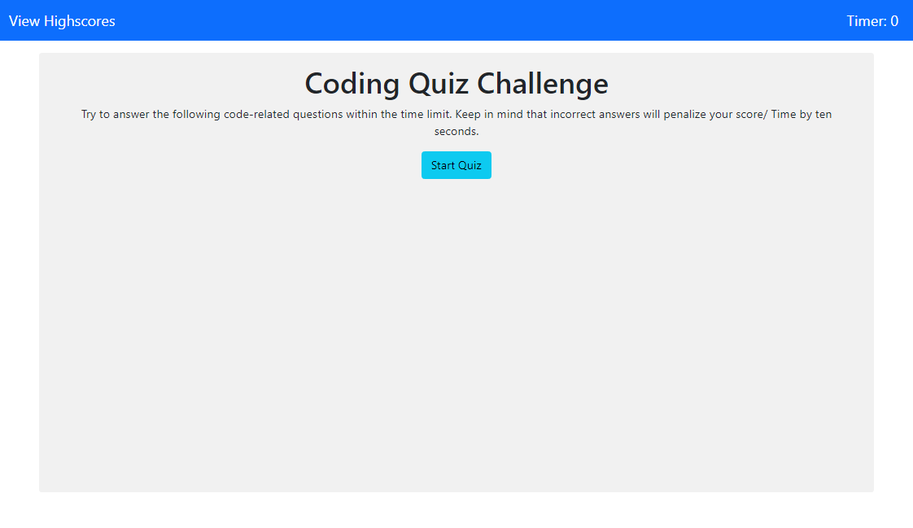
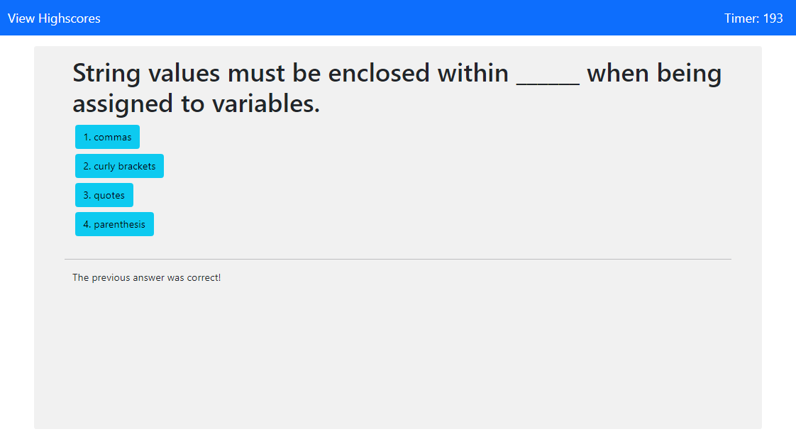
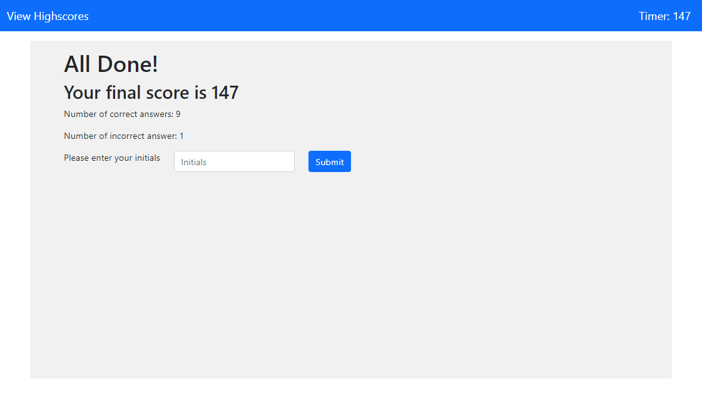
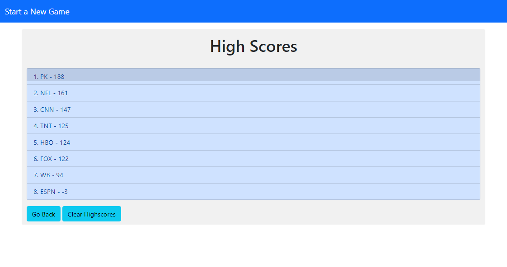

# code-quiz-game
An HTML-based coding quiz game, dynamically updated and tracked using DOM manipulation and local storage

## Description
The application is an HTML-based coding quiz game.  The content is dynamically generated to a single page using JavaScript and DOM manipulation.  Styling is mostly applied though Bootstrap CSS framework styling classes.  User scores are stored locally using the localStorage web API object.

### Features
* Ten coding-related multiple choice questions
* Buttons which allow the user to select an answer
* Text prompts in the browser window which tell the user if the selected answer was correct of incorrect
* Countdown timer which tracks the user time/ score
* Penalty system that subtracts 10 seconds from the user score if an incorrect answer is selected
* Results page which display the user scores and allows the user to submit their first name or initials for a high score list
* A high score page which displays a list of the user's high scores, and allows the users to clear the scores from the page and localStorage

## Installation
Upload index.html, highscores.html, license.txt, and assets folder to the deployed webserver.  Assets folder contains JavaScript and CSS files.

The application shown below was deployed using GitHub Pages.  The repository can be replicated by via fork, clone, and redeployment with GitHub Pages.

Link to repository: [https://github.com/pkriengsiri/code-quiz-game](https://github.com/pkriengsiri/code-quiz-game)

## Usage
Link to deployed instance of the application: [https://pkriengsiri.github.io/code-quiz-game/](https://pkriengsiri.github.io/code-quiz-game/)

The application has clickable buttons to start and progress through the quiz.  All content is generated dynamically on the index.html page, with the exception of user high scores which can be viewed and cleared on a separate page.

## Credits
Collaborators on this project included instructional staff, TAs, and students in the Georgia Tech Coding Boot Camp Winter 2020 cohort.

### Referenced Utilized
* https://developer.mozilla.org/en-US/docs/Web/API/Window/localStorage

* https://developer.mozilla.org/en-US/docs/Web/API/Element/classList

* https://getbootstrap.com/docs/5.0/getting-started/introduction/ 

* https://www.w3schools.com/jsref/jsref_sort.asp

* https://www.w3schools.com/tags/att_hidden.asp 

* https://developer.mozilla.org/en-US/docs/Web/JavaScript/Reference/Global_Objects/Array/sort 

## License

MIT License

Copyright (c) [2020] [Pete Kriengsiri]

Permission is hereby granted, free of charge, to any person obtaining a copy
of this software and associated documentation files (the "Software"), to deal
in the Software without restriction, including without limitation the rights
to use, copy, modify, merge, publish, distribute, sublicense, and/or sell
copies of the Software, and to permit persons to whom the Software is
furnished to do so, subject to the following conditions:

The above copyright notice and this permission notice shall be included in all
copies or substantial portions of the Software.

THE SOFTWARE IS PROVIDED "AS IS", WITHOUT WARRANTY OF ANY KIND, EXPRESS OR
IMPLIED, INCLUDING BUT NOT LIMITED TO THE WARRANTIES OF MERCHANTABILITY,
FITNESS FOR A PARTICULAR PURPOSE AND NONINFRINGEMENT. IN NO EVENT SHALL THE
AUTHORS OR COPYRIGHT HOLDERS BE LIABLE FOR ANY CLAIM, DAMAGES OR OTHER
LIABILITY, WHETHER IN AN ACTION OF CONTRACT, TORT OR OTHERWISE, ARISING FROM,
OUT OF OR IN CONNECTION WITH THE SOFTWARE OR THE USE OR OTHER DEALINGS IN THE
SOFTWARE.

## Badges

## Contributing

This project is not accepting contributions at this time.